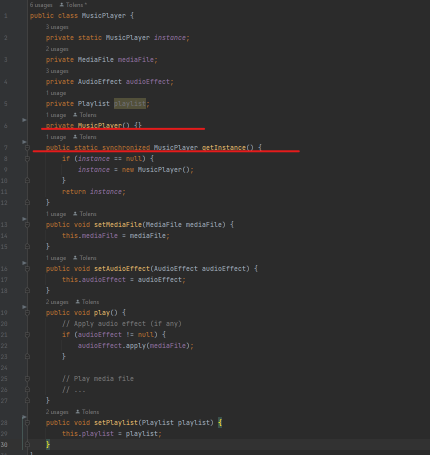
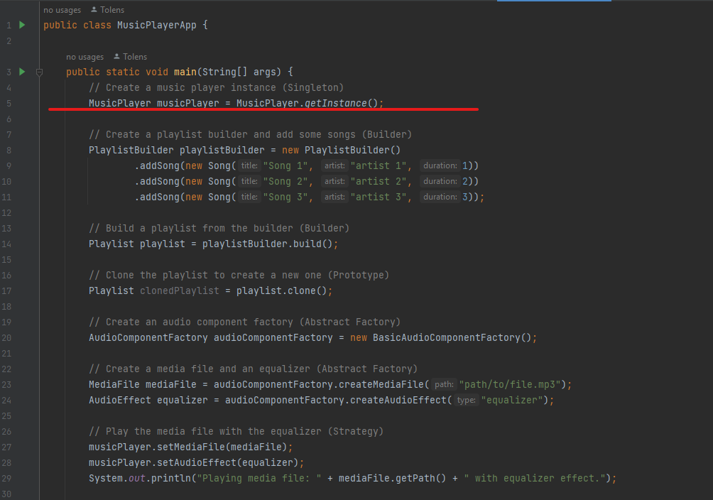
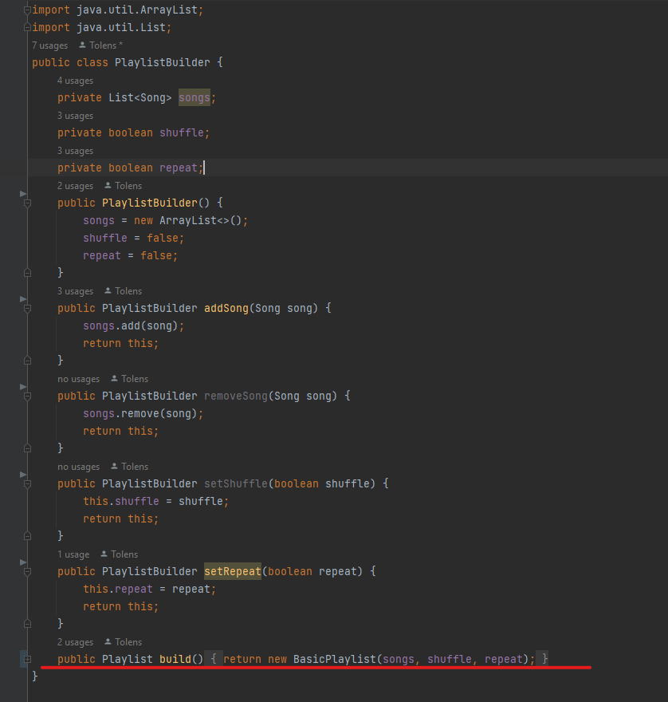
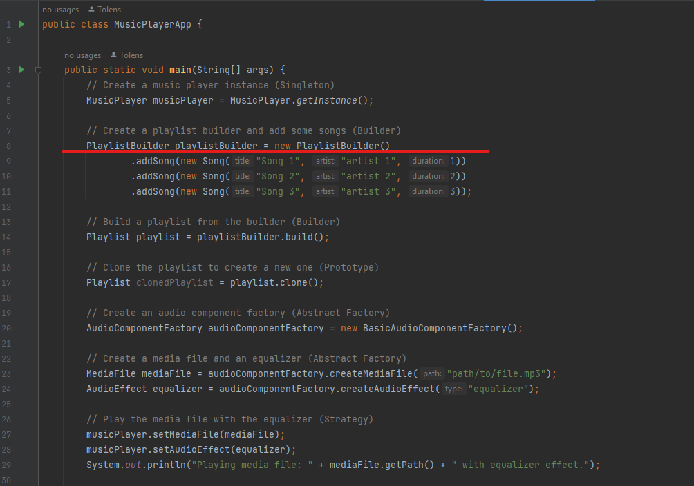
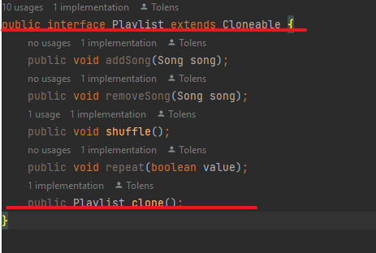
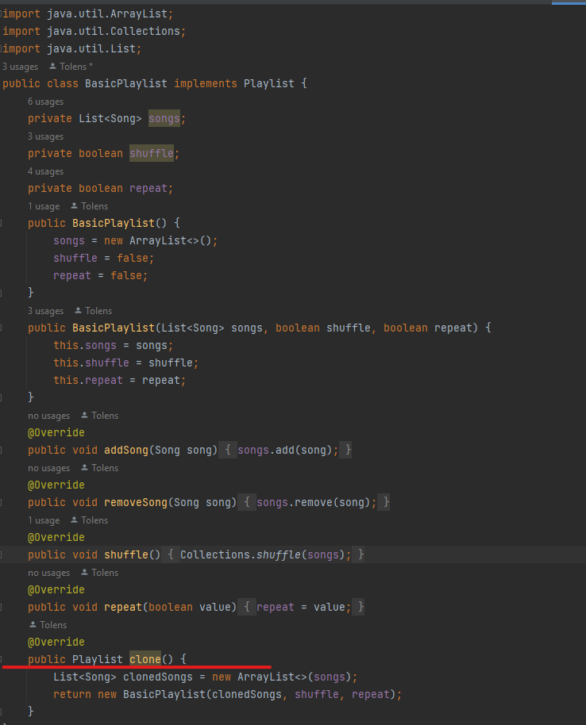
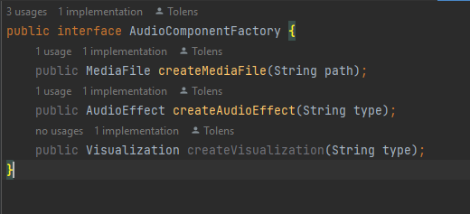
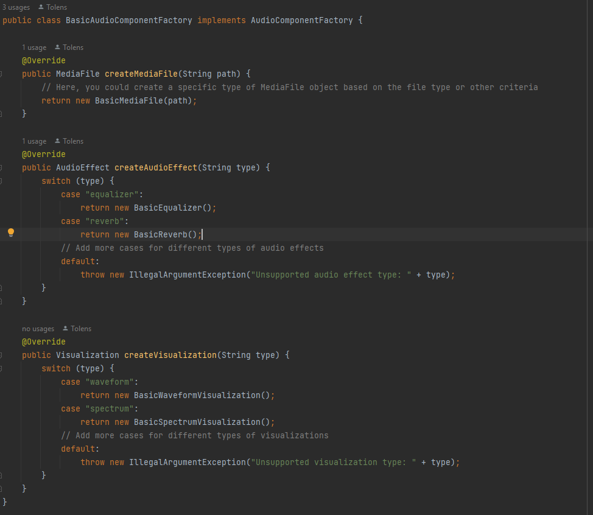
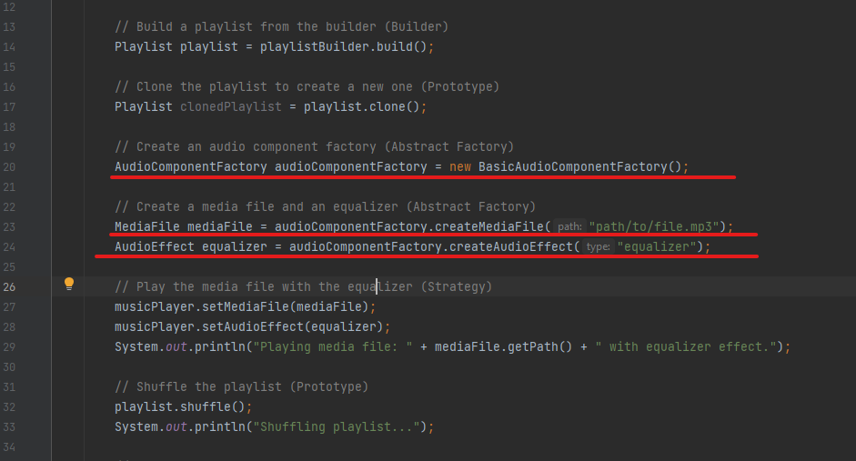

# Design Patterns
## Singleton
The Singleton design pattern is used in the MusicPlayer class to ensure that only one instance of the music player is created and used throughout the application.

## Builder
The Builder design pattern is used in the PlaylistBuilder class to provide a convenient way to create playlists by allowing the user to add or remove songs and set shuffle and repeat flags.

## Prototype
The Prototype design pattern is used in the BasicPlaylist class to implement the Playlist interface and provide a method for cloning a playlist to create a new one.

## Abstract Factory
The Abstract Factory design pattern is used in the BasicAudioComponentFactory class to provide concrete implementations of the AudioComponentFactory interface's createMediaFile(), createAudioEffect(), and createVisualization() methods. The BasicAudioComponentFactory creates different types of audio components (i.e. media files, audio effects, and visualizations) based on user input.

